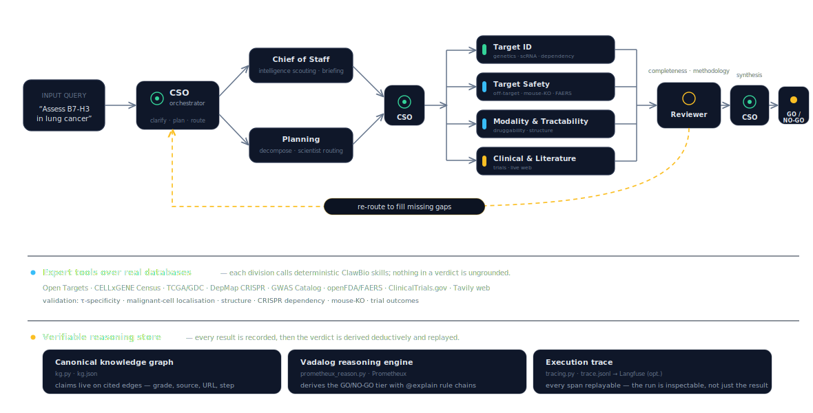

<div align="center">

# 🧬 Virtual Biotech CSO

### A multi-agent AI that nominates drug targets — and *shows its work*

**[Multiagents Hackathon](https://multiagents-hackathon.devpost.com/) · Tessl AI · London · 26 Jun 2026**

[](https://prometheux.ai)
[](https://tavily.com)
[](https://github.com/ClawBio/ClawBio)
[-94a3b8)](https://www.biorxiv.org/content/10.64898/2026.02.23.707551v1)

</div>

---

## The pitch (60 seconds)

Picking a drug target is the most expensive guess in biotech — **90% of clinical programs fail**, most because the target was wrong. The Stanford "[Virtual Biotech](https://www.biorxiv.org/content/10.64898/2026.02.23.707551v1)" paper showed a multi-agent AI org can do this work at scale, and found a striking signal: **single-cell-specific targets are 40% more likely to clear Phase I→II and carry 32% lower adverse-event rates.**

We turn that paper into a **real, running multi-agent system** — and we add the one thing a scientist actually needs to trust an AI verdict: **provenance**. The GO / NO-GO is *not* generated by an LLM. It is **derived deductively** from cited evidence by a **Prometheux Vadalog** engine, with a replayable reasoning chain behind every conclusion.

> **A virtual R&D org as code:** a CSO orchestrator plans and routes, four scientist divisions run real bioinformatics over live public databases, a reviewer panel audits and *forces re-work*, and a reasoning engine turns the cited evidence into an explainable verdict. Runs fully offline with `--demo`; goes live with real models + databases on a flag.

### Why it fits the brief — *"build something real with multi-agent systems"*

| Judging criterion | How this project answers it |
|---|---|
| **Meaningful problem** | Target selection is the costliest guess in biotech (90% clinical failure); we operationalise a peer-reviewed result that predicts trial success. |
| **Technical implementation** | A true agent org — orchestrator + 4 scientist divisions + a voting reviewer panel + a deductive gap-detector — with a re-route control loop, not a single prompt chain. |
| **Effective tool use** | **Prometheux** derives the verdict; **Tavily** powers live literature search; agents call real databases (Open Targets, CELLxGENE, TCGA, DepMap, openFDA, ClinicalTrials.gov). |
| **Agent autonomy on real-time data** | The reviewer panel autonomously detects missing evidence and re-routes the org to fetch it — no human in the loop. |
| **Demo quality** | One command reproduces a full verdict bit-for-bit, offline; a live mode swaps in real models + databases. |

> 🎯 **Targeting the Prometheux Intelligence Prize:** the entire verdict layer is a **Vadalog program** ([`prometheux_reason.py`](skills/virtual-biotech-cso/prometheux_reason.py)) — recursive rules, `@model`/`@explain` annotations, and a non-silenceable structural gap-detector that turns "a prioritization axis is missing" into a *deductive fact* that forces agent re-work. Tavily (lit search) and ClawBio (skill runtime) round out the sponsor stack.

---

## 🗺️ How it works



The system has three layers, top to bottom in the diagram:

1. **Agentic reasoning loop** — `query → Chief-of-Staff briefing → CSO decomposes & routes → four scientist divisions → Scientific Reviewer panel → (re-route to fill gaps) → CSO synthesis → GO/NO-GO`. The reviewer can **force exactly one re-route** when a prioritization axis is missing — that loop is the gold dashed arc.
2. **Expert tools over real databases** — each division calls deterministic **ClawBio** skills (Open Targets, CELLxGENE Census, TCGA/GDC, DepMap, GWAS Catalog, openFDA/FAERS, ClinicalTrials.gov, Tavily). Nothing in a verdict is ungrounded.
3. **Verifiable reasoning store** — a canonical **knowledge graph** of cited edges → a **Prometheux Vadalog** engine that *derives* the verdict tier with `@explain` rule chains → an **execution trace** (`trace.jsonl`, optional Langfuse mirror) so the whole run replays.

---

## 🤖 The multi-agent framework, demonstrated

This is the heart of the submission. Run it and watch the org work — fully offline, no keys:

```bash
python skills/virtual-biotech-cso/harness.py --demo
#  or:  clawbio run virtual-biotech-cso --demo
```

You'll see the agent roles execute and the re-route loop fire, e.g.:

```text
📋  Chief of Staff: briefing on "Assess B7-H3 in lung cancer"  (field context · data availability)
🧭  CSO: decomposed into 6 sub-tasks → routed across 4 divisions
     ├─ Target ID & Prioritization   → cellxgene-fetch · celltype-specificity-profiler · tcga-somatic-profiler
     ├─ Target Safety                → opentargets-target-factors · openfda-safety
     ├─ Modality & Tractability      → struct-predictor · omics-target-evidence-mapper
     └─ Clinical & Literature        → clinical-trial-finder · lit-synthesizer
🔬  scientist:target_id … writes cited edges → knowledge graph (kg.json)
👥  reviewer panel: 2/4 lenses vote re-route  (gap: malignant-cell localisation absent)
🟡  re-route → malignant-expression-profiler  (one pass, then synthesize)
🧠  prometheux: derive GO/NO-GO  →  TIER = SUPPORTED  (@explain: τ-specific ∧ tumour-localised ∧ trial-active)
✅  reviewer verdict: synthesize
📝  report.md · result.json · trace.jsonl  written to ./output
```

**Why this is genuinely multi-agent — not one prompt in a trench coat:**

| Role | What it does | Where it lives |
|---|---|---|
| **CSO Orchestrator** | Clarifies intent, decomposes the query, routes sub-tasks, synthesizes. *Runs no analysis itself.* | [`cso.py`](skills/virtual-biotech-cso/cso.py) · [`prompts/orchestrator.md`](skills/virtual-biotech-cso/prompts/orchestrator.md) |
| **Chief of Staff** | A pre-analysis briefing: field context + data availability, so effort goes where it counts. | [`prompts/chief_of_staff.md`](skills/virtual-biotech-cso/prompts/chief_of_staff.md) |
| **Scientist divisions** (×4) | Each calls real ClawBio skills over public databases and records **cited edges**. | [`routing.yaml`](skills/virtual-biotech-cso/routing.yaml) |
| **Scientific Reviewer panel** | Multiple lenses (completeness · methodology · …) vote; a majority **forces a re-route**. | [`prompts/reviewer.md`](skills/virtual-biotech-cso/prompts/reviewer.md) · [`harness.py`](skills/virtual-biotech-cso/harness.py) |
| **Prometheux gap-detector** | A *non-silenceable* panel member: a provably-missing axis is a deductive fact, so it forces re-work on its own. | [`prometheux_reason.py`](skills/virtual-biotech-cso/prometheux_reason.py) |

Two execution modes, **identical output shape**:

```bash
# OFFLINE / reproducible — cached fixtures, in-process reasoner, no LLM, no keys
python skills/virtual-biotech-cso/harness.py --demo

# LIVE — real LLM agents (Anthropic→OpenAI→Gemini→Claude CLI) + live ClawBio skills + Prometheux
python skills/virtual-biotech-cso/harness.py --live --backend auto \
       --query "Assess KRAS G12C in colorectal cancer"
```

`--demo` exists so a judge can reproduce a verdict bit-for-bit with zero setup; `--live` is the same loop with the real backends swapped in.

---

## 🎰 Information maximization under a token budget

Every re-route costs tokens (LLM agent calls + skill execution), so the loop can't chase
every possible gap. The design principle is simple: **spend the next agent call on the
evidence that most changes the verdict, and stop when the budget says the marginal gap
isn't worth it.** Three mechanisms in the code enforce this:

1. **A hard token budget gates exploration.** The loop always runs its *core passes* — the
   four load-bearing prioritization axes (validity · specificity · safety · tractability),
   which are forced regardless of cost. Past that, it only keeps chasing the broader
   *desired* axes while measured spend stays under the budget
   ([`harness.py`](skills/virtual-biotech-cso/harness.py): `DEFAULT_TOKEN_BUDGET = 60_000`,
   `_budget_room()`). A thin run converges on the core four; a budget-rich run fills the
   rest. The meter is `rec.totals` — the same token count [Langfuse](https://langfuse.com) mirrors.
2. **Gaps are ranked by expected information, then spent greedily.** Candidate gaps sort by
   `(forces_reroute, corroborating-lens-count)` descending
   ([`cso.py`](skills/virtual-biotech-cso/cso.py): `aggregate_panel_review`), so a *provably
   missing required axis* is always filled before a merely-corroborated soft gap. The next
   re-route always goes to the highest-value arm available.
3. **No thrash — never pull a depleted arm.** A re-route that resolves to an
   already-answered skill+question adds zero information, so the loop skips it and converges
   ([`harness.py`](skills/virtual-biotech-cso/harness.py), `executed` set). The rule is sharp,
   not blunt: a *question-sensitive* arm like live literature search **may** re-run on a
   genuinely *deeper* question, but the **same** question is refused outright — the loop
   deepens, it doesn't spin. This convergence is **regression-tested, not hoped for** —
   `test_loop_stops_when_reroute_would_rerun_a_covered_skill`,
   `test_live_loop_is_bounded_at_max_reroutes`, and the two `deeper_reroute` cases pin every
   edge of the policy (all 28 harness tests green).

> **Multi-arm bandit, by analogy.** Each candidate skill is an *arm*; its expected
> *information gain* about the verdict is the reward; the token budget is the total pulls
> you can afford. We deliberately run the **greedy / pure-exploitation** policy — pull the
> highest expected-information arm each round, structurally-forced axes first — because in a
> single short investigation, exploration regret isn't worth paying: the four core axes are
> known *a priori* to be decision-relevant, so there's nothing to learn about which arms
> matter. **This is a conceptual framing, not a learned bandit** — there are no reward
> estimates, no UCB/Thompson exploration term, and no cross-run regret tracking. The honest
> upgrade path (a real bandit) is to *learn* per-skill information-gain priors across many
> target assessments and let the selector explore under uncertainty — promising future work,
> not what ships today.

---

## 🧱 The framework (architecture from the paper)

**4 scientific divisions · 11 agents · 100+ data tools**, spanning 78,726 targets, 39,530 diseases, 14.5M protein–protein interactions, 100M+ single-cell profiles, and 4B+ drug-perturbation measurements (Tahoe-100M).

| Division | Scientist agents | Data sources |
|---|---|---|
| **Target ID & Prioritization** | Statistical Genetics, Functional Genomics, Single-Cell Atlas | GWAS, QTL, gnomAD, ClinVar, DepMap CRISPR, CELLxGENE Census, Tahoe-100M |
| **Target Safety** | Bio Pathways & PPI, FDA Safety Officer, Single-Cell Atlas | IntAct, Reactome, STRING, GO, openFDA/FAERS, GTEx |
| **Modality Selection** | Target Biologist, Pharmacologist | Human Protein Atlas, Tractability, ChEMBL, Mouse-KO |
| **Clinical Officers** | Clinical Trialist, FDA Safety Officer | ClinicalTrials.gov, PubMed, cBioPortal (TCGA) |

**Office of the CSO** — `CSO Orchestrator` (plans/routes/synthesizes), `Chief of Staff` (briefing), `Scientific Reviewer` (audits, triggers re-routing).

---

## ⭐ What we built

The org is assembled on the **ClawBio** skill platform — we reuse its ~128 existing bioinformatics skills as the scientist agents' tools, and contribute the two pieces the workflow needed (both also clean upstream PRs):

### 1. `virtual-biotech-cso` — the multi-agent orchestrator
The paper's loop as a first-class, **keyless** ClawBio skill ([`skills/virtual-biotech-cso/`](skills/virtual-biotech-cso/)). The skill itself makes **no LLM call** — it's deterministic routing + report assembly; the reasoning roles are delegated to the *driving agent* via [`prompts/`](skills/virtual-biotech-cso/prompts/), and the verdict is derived by the Prometheux engine. Demonstrated on the **B7-H3 lung-cancer ADC** case study ([workflows/b7h3_adc_nomination.md](workflows/b7h3_adc_nomination.md)).

### 2. `celltype-specificity-profiler` — the missing single-cell primitive
**Verified gap:** none of the 128 catalog skills compute per-gene cell-type specificity — the very signal the paper shows predicts trial success. We add it ([README](skills/celltype-specificity-profiler/README.md)):
- **τ specificity index** (0 = ubiquitous → 1 = single-cell-type restricted)
- **bimodality coefficient** — the paper's cross-domain transfer from psychometrics (ρ≈0.54 with τ)
- Optional `--trial-prior` maps both features to the paper's published odds ratios (labeled *Zhang et al. 2026*)
- `clawbio run celltype-specificity-profiler --demo` runs offline on bundled real data (scanpy `pbmc3k`, gene MS4A1).

> **Stretch:** the reviewer can call `equity-scorer` so each assessment reports cross-population coverage of its single-cell / GWAS references — the paper's atlases skew to specific ancestries.

---

## 🧰 Sponsor tools

Every integration is **optional and degrades to an offline, reproducible path** — the workflow always runs with no keys. Set vars in `.env` (copy [`.env.example`](.env.example)) to go live.

| Sponsor tool | Powers | Live trigger | Offline fallback |
|---|---|---|---|
| **ClawBio** | Skill platform + runtime | `clawbio run <skill>` / `--live` | `--demo` cached fixtures |
| **Prometheux** (Vadalog) | Explainable verdict + reviewer gap-detector | `PMTX_TOKEN` + `JARVISPY_URL` | In-process Datalog (same result shape) |
| **Langfuse** | Hosted nested trace of the loop | `LANGFUSE_PUBLIC_KEY` + `LANGFUSE_SECRET_KEY` | local `trace.jsonl` |
| **Tavily** | Live web search (`lit-synthesizer`) | `TAVILY_API_KEY` | cached `--demo` response |

<details>
<summary><b>Setup details for each</b></summary>

**ClawBio** — `pip install clawbio` (or `/plugin install clawbio` in Claude Code). `--backend auto` picks the first available LLM: `ANTHROPIC_API_KEY` → `OPENAI_API_KEY` → `GEMINI_API_KEY`/`GOOGLE_API_KEY` → Claude Code CLI (no key).

**Prometheux** — powers `differentiates`/`co_niche`/`strong_claim` reasoning and the reviewer's structural gap-detector ([`prometheux_reason.py`](skills/virtual-biotech-cso/prometheux_reason.py)).
```bash
PMTX_TOKEN=<token>
JARVISPY_URL=https://api.prometheux.ai/jarvispy/{org}/{username}   # org/user from token JWT
```
Both vars required for the live path (SDK defaults to `localhost:8000`), plus an **active compute machine** (Prometheux app → Compute Management) or calls return `NO_ACTIVE_COMPUTE`. Unset → the in-process reasoner runs the identical rule set, no network.

**Langfuse** — `pip install 'langfuse>=4.0'` then set `LANGFUSE_PUBLIC_KEY` / `LANGFUSE_SECRET_KEY` (`LANGFUSE_HOST` for self-hosted). Mirrors the full span tree to a hosted trace; the local `trace.jsonl` is always the source of truth.

**Tavily** — set `TAVILY_API_KEY` for live three-angle web search in `lit-synthesizer`; every result carries its source URL. `--demo` needs no key or network.

</details>

---

## 🚀 Quick start

```bash
# 1. Install the platform (~128 skills + runtime)
pip install clawbio            # or: /plugin install clawbio  (Claude Code)

# 2. The headline demo — full multi-agent loop, fully offline
clawbio run virtual-biotech-cso --demo
#   → briefing → routed scientist chain → reviewer re-route → Prometheux verdict
#   → report.md · result.json · trace.jsonl

# 3. The new single-cell primitive on bundled real data
clawbio run celltype-specificity-profiler --demo

# 4. Drive the loop directly + go live
python skills/virtual-biotech-cso/harness.py --live --backend auto \
       --query "Assess <target> in <disease>"
```

---

## 📁 Repository structure

```text
├── skills/
│   ├── virtual-biotech-cso/            # PRIMARY — the orchestration skill (PR #2)
│   │   ├── cso.py / harness.py         # the loop: brief → route → reviewer → synthesize
│   │   ├── routing.yaml                # query intent → ClawBio skill map
│   │   ├── prompts/                    # chief_of_staff · reviewer · orchestrator
│   │   ├── prometheux_reason.py        # Vadalog reasoning + gap-detector
│   │   ├── tracing.py                  # trace.jsonl (+ optional Langfuse)
│   │   └── demo_data/b7h3/             # cached, offline B7-H3 fixtures
│   ├── celltype-specificity-profiler/  # SUPPORTING — the missing primitive (ClawBio#307)
│   └── …                               # cellxgene-fetch · openfda-safety · lit-synthesizer · …
├── frontend/                           # interactive UI + system schematic
├── docs/                               # design notes, evidence-gap analysis, applicability reviews
├── workflows/b7h3_adc_nomination.md    # the case study walkthrough
└── data/
```

---

## 📚 References

- **Hackathon:** [Multiagents Hackathon](https://multiagents-hackathon.devpost.com/) — Tessl AI, London, 26 Jun 2026 · sponsors: Google DeepMind · ClickHouse · Gensyn · **Prometheux** · **Tavily** · Cursor · ElevenLabs · Twilio · Senso
- **Paper:** [The Virtual Biotech (bioRxiv)](https://www.biorxiv.org/content/10.64898/2026.02.23.707551v1) — Zhang, Eckmann, Miao, Mahon & Zou, Stanford / PHD Biosciences, 2026 · mirror [PMC12970349](https://pmc.ncbi.nlm.nih.gov/articles/PMC12970349/)
- **Platform:** [ClawBio](https://github.com/ClawBio/ClawBio) · [clawbio.ai](https://clawbio.ai/)
- **Sponsor tools:** [Prometheux](https://prometheux.ai) (Vadalog reasoning) · [Tavily](https://tavily.com) (search)
- **Methods/data:** Tabula Sapiens v2 · CELLxGENE Census · Tahoe-100M · Open Targets · ClinicalTrials.gov · τ specificity index · bimodality coefficient

<div align="center"><sub>ClawBio is a research and educational tool — not a medical device.</sub></div>
